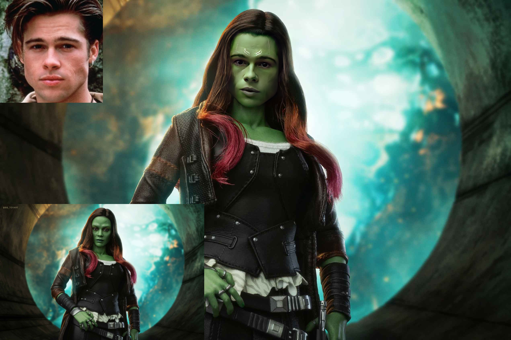
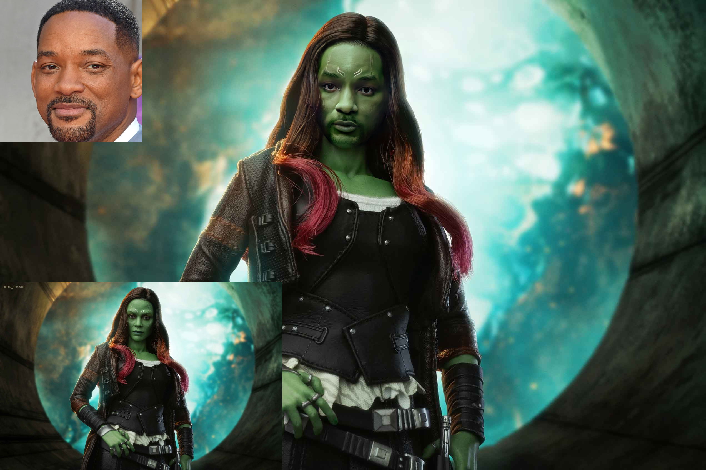
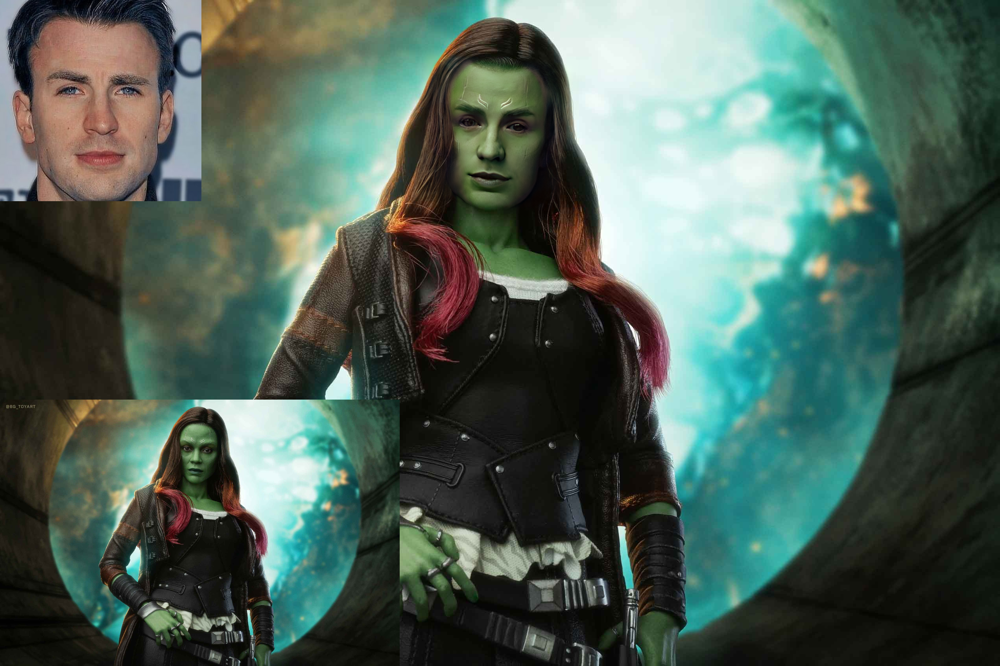
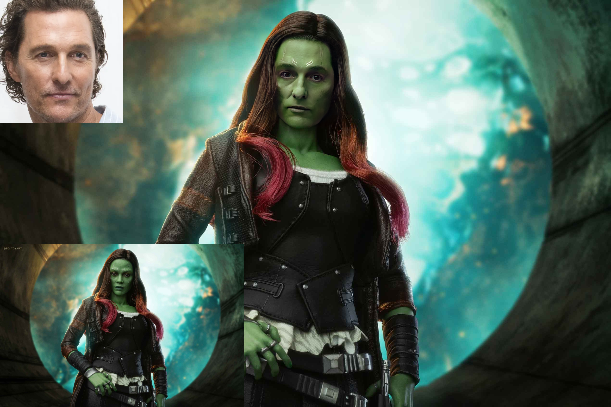
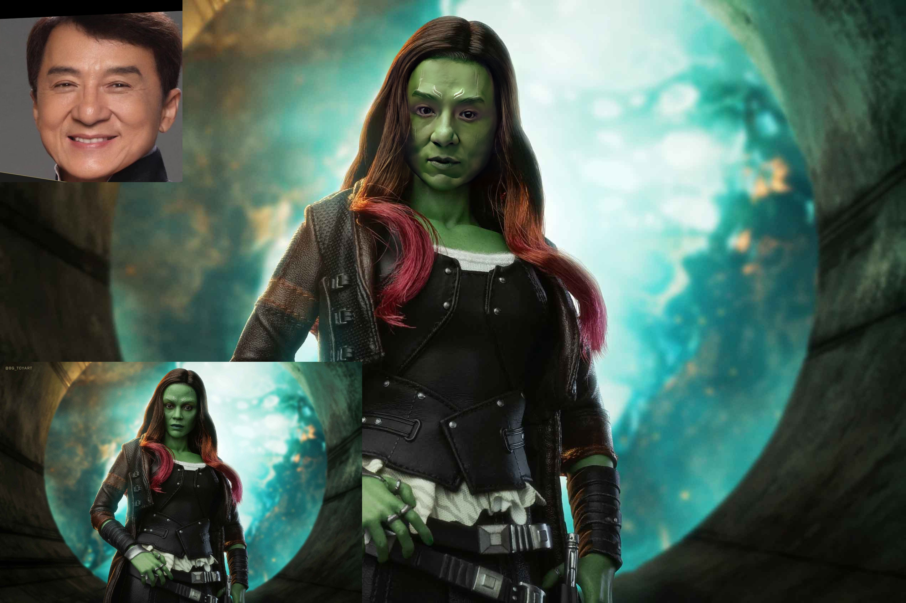
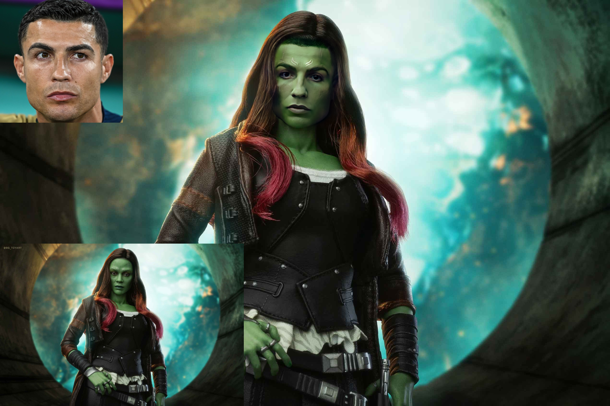
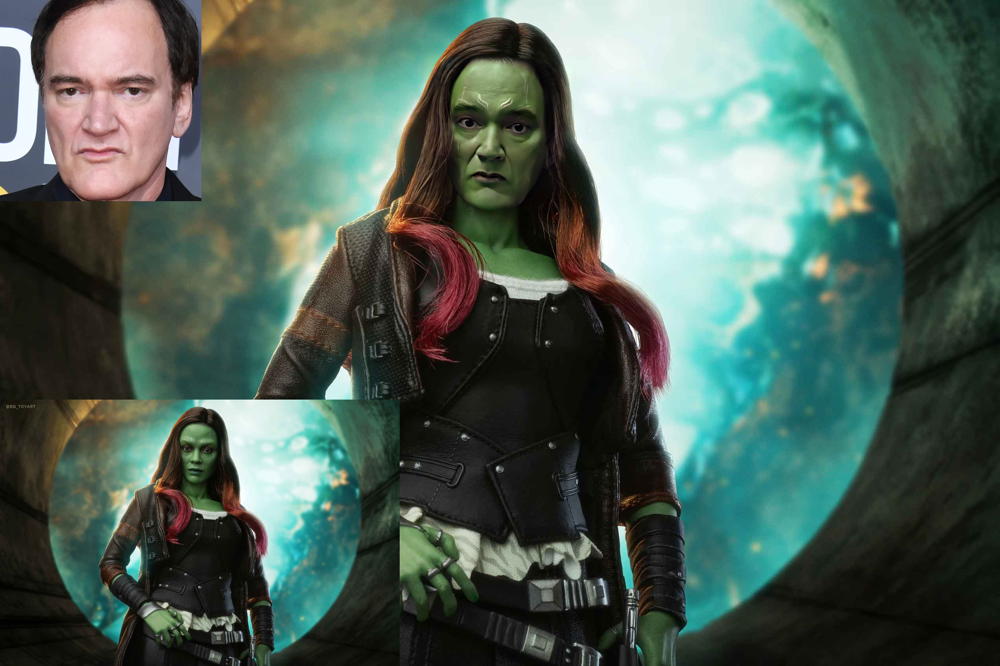

# SimSwap++: Towards Faster and High-Quality Identity Swapping
## Accepted by TPAMI (i.e., IEEE Transactions on Pattern Analysis and Machine Intelligence)
### [Xuanhong Chen](https://scholar.google.com/citations?user=UuCqlfEAAAAJ&hl=en), [Bingbing Ni](https://scholar.google.com/citations?user=V9W87PYAAAAJ&hl=en) $\dagger$, Yutian Liu, Naiyuan Liu, Linzhi Zeng, Hang Wang
$\dagger$ Corresponding author

## Project page of SimSwap++

##  ***Please note that the current respository is a supplementary material for the SimSwap++ paper, NO issues will be replied at this stage. Once everything is ready we will release training and testing codes like our [SimSwap](https://github.com/neuralchen/SimSwap).***


[](https://github.com/neuralchen/SimSwapPlus)


# Methodology of SimSwap++
## Additional Results:

[Source ID: Angelina Jolie Target ID: Gamora]


[Source ID: Tom Cruise Target ID: Gamora]


[Source ID: Brad Pitt Target ID: Gamora]



[Source ID: Will Smith Target ID: Gamora]



[Source ID: Geoffrey Hinton Target ID: Gamora]


[Source ID: Captain America Chris Evans Target ID: Gamora]



[Source ID: Jim Carrey Target ID: Gamora]


[Source ID: Matthew McConaughey Target ID: Gamora]



[Source ID: Jackie Chan Target ID: Gamora]



[Source ID: Messi Target ID: Gamora]


[Source ID: Kylian Mbappé Target ID: Gamora]


[Source ID: Cristiano Ronaldo Target ID: Gamora]



[Source ID: Quentin Tarantino Target ID: Gamora]



## Video in-the-wild Results (under construction):
### Videos are generated frame by frame without any temporal smoothing (e.g., Kalman Filter), which may cause some subtle flickering.

### Group1 [SimSwap++ (S)]:

[Source ID: Scarlett Johansson Target ID: Shakira (1080p on YouTube)](https://youtu.be/4qnoV80MVKc)

[](https://youtu.be/4qnoV80MVKc)

[Source ID: Dilireba Target ID: Shakira (1080p on Google Drive)](https://drive.google.com/file/d/1UDj9yw_uhAyxbASijOQhKQfKXiS2KFEv/view?usp=sharing)

[](https://drive.google.com/file/d/1UDj9yw_uhAyxbASijOQhKQfKXiS2KFEv/view?usp=sharing)

[Source ID: Tom Cruise Target ID: Shakira (1080p on Google Drive)](https://drive.google.com/file/d/1N87we7Tf-gz5X0YJqOB6YVJNf84Yg9vk/view?usp=sharing)

[](https://drive.google.com/file/d/1N87we7Tf-gz5X0YJqOB6YVJNf84Yg9vk/view?usp=sharing)

[Source ID: Elon Musk Target ID: Shakira (1080p on Google Drive)](https://drive.google.com/file/d/1zutwS3pPKKnt-WwsolPNC1HQyBzgmMU7/view?usp=sharing)

Musk's face is always so recognizable!

[](https://drive.google.com/file/d/1zutwS3pPKKnt-WwsolPNC1HQyBzgmMU7/view?usp=sharing)

[Source ID: Keira Knightley Target ID: Shakira (1080p on Google Drive)](https://drive.google.com/file/d/1uJWmQ9Hv3c3XM26fCGmZhjdEfnUujiAJ/view?usp=sharing)

[](https://drive.google.com/file/d/1uJWmQ9Hv3c3XM26fCGmZhjdEfnUujiAJ/view?usp=sharing)

[Source ID: Brad Pitt Target ID: Shakira (1080p on Google Drive)](https://drive.google.com/file/d/1vXe0awnEmuDVj8m3akfDSyYzGB0VyXoo/view?usp=sharing)

[](https://drive.google.com/file/d/1vXe0awnEmuDVj8m3akfDSyYzGB0VyXoo/view?usp=sharing)

[Source ID: Nicole Kidman Target ID: Shakira (1080p on Google Drive)](https://drive.google.com/file/d/1jUESffXxB7K-3siG5GK4STGxAs2hTiJ3/view?usp=sharing)

[](https://drive.google.com/file/d/1jUESffXxB7K-3siG5GK4STGxAs2hTiJ3/view?usp=sharing)


### Group2 [SimSwap++ (S)]:
[Source ID: Kelly Clarkson Target ID: Taylor Swift (1080p on YouTube)](https://www.youtube.com/watch?v=U9WFnMHs6Nw)


[Source ID: Geoffrey Hinton Target ID: Taylor Swift (1080p on YouTube)](https://youtu.be/QLrneMYKki0)

[](https://youtu.be/QLrneMYKki0)

[Source ID: Gal Gadot Target ID: Taylor Swift (1080p on YouTube)](https://youtu.be/I00NuaICEQE)

[](https://youtu.be/I00NuaICEQE)

[Source ID: Leonardo DiCaprio Target ID: Taylor Swift (1080p on YouTube)](https://www.youtube.com/watch?v=75W6j-0ux4k)


[Source ID: Elon Musk Target ID: Taylor Swift (1080p on YouTube)](https://youtu.be/YRhql8WGSIE)

[](https://youtu.be/YRhql8WGSIE)


[Source ID: Robert Downey Target ID: Taylor Swift (1080p on YouTube)](https://www.youtube.com/watch?v=qbmtj4z0RmE)

[](https://www.youtube.com/watch?v=qbmtj4z0RmE)

[Source ID: Aamir Khan Target ID: Taylor Swift (1080p on YouTube)](https://youtu.be/BY-sMBTbtBU)

[](https://youtu.be/BY-sMBTbtBU)

### Group3 [SimSwap++ (S)] Complex Movie Scene:

### I am Iron Man
***Few previous face-swapping papers have published such complex movie scenes***

***The subtle flickering can be resolved by introducing temporal smoothing, which is not our concern***

[Source ID: Captain America Chris Evans Target ID: Iron Man (1080p on YouTube)](https://youtu.be/LizpujG-qpo)

[](https://youtu.be/LizpujG-qpo)

[Source ID: Scarlett Johansson Target ID: Iron Man (1080p on YouTube)](https://youtu.be/zMpejDaYFHg)

[](https://youtu.be/zMpejDaYFHg)

[Source ID: Elon Musk Target ID: Iron Man (1080p on Google Drive)](https://drive.google.com/file/d/1AYWRzUppslvvzzFvBL4JiCvpum_ZCeUL/view?usp=sharing)

[](https://drive.google.com/file/d/1AYWRzUppslvvzzFvBL4JiCvpum_ZCeUL/view?usp=sharing)

[Source ID: Leonardo Target ID: Iron Man (1080p on YouTube)](https://youtu.be/i2PduIAJomM)

[](https://youtu.be/i2PduIAJomM)

[Source ID: Gal Gadot Target ID: Iron Man (1080p on YouTube)](https://youtu.be/uOv23zrSOF8)

[](https://youtu.be/uOv23zrSOF8)


# VGGFace2-HQ Dataset
VGGFace2-HQ contains more than $1.36M$ $512 \times 512$ aligned
face images and up to $9, 630$ distinct identities. In addition, this dataset
consists of two parts:
- (1) a natural image sub-collection, which collects up to $200, 000$ images covering $1, 000$ different identities;
- (2) a synthetic image sub-collection, containing $8, 630$ cleaned and re-annotated identities (i.e., clean up the images with mismatching identities and low-quality faces in the cropped [VGGFace2](https://github.com/ox-vgg/vgg_face2)).

## Download the dataset:
<!-- ***Limited by the capacity of the cloud disk, we divided the dataset into two parts*** -->

### Via Google Drive:

[[Google Drive]  VGGFace2-HQ](https://drive.google.com/drive/folders/1ZHy7jrd6cGb2lUa4qYugXe41G_Ef9Ibw?usp=sharing)

<!-- [[Google Drive]  VGGFace2-HQ Part2 (89GB)](https://drive.google.com/drive/folders/1ZHy7jrd6cGb2lUa4qYugXe41G_Ef9Ibw?usp=sharing) -->

***We are especially grateful to [Kairui Feng](https://scholar.google.com.hk/citations?user=4N5hE8YAAAAJ&hl=zh-CN) PhD student from Princeton University.***

### Via Baidu Drive:

[[Baidu Drive] VGGFace2-HQ](https://pan.baidu.com/s/1LwPFhgbdBj5AeoPTXgoqDw) Password: ```sjtu```

<!-- [[Baidu Drive] VGGFace2-HQ Part2 (89GB)](https://pan.baidu.com/s/1LwPFhgbdBj5AeoPTXgoqDw) Password: ```sjtu``` -->

## Samples from VGGFace2-HQ

### Natural Part:

[](https://github.com/neuralchen/SimSwapPlus)

### Synthetic Part:

[](https://github.com/neuralchen/SimSwapPlus)

# Acknowledgements

<!--ts-->
* [GFPGAN](https://github.com/TencentARC/GFPGAN)
* [Insightface](https://github.com/deepinsight/insightface)
* [VGGFace2 Dataset for Face Recognition](https://github.com/ox-vgg/vgg_face2)
<!--te-->
